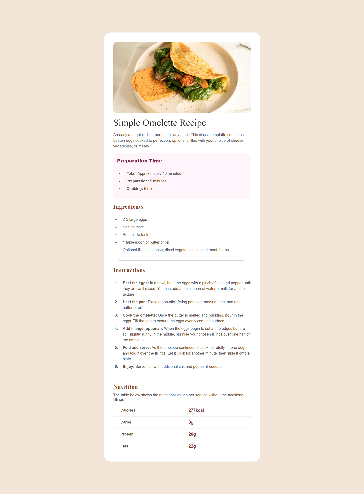
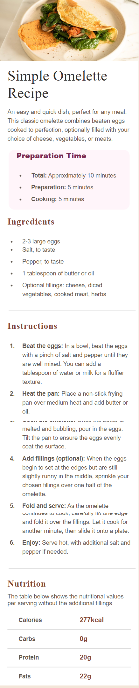

# Frontend Mentor - Recipe page solution

This is a solution to the [Recipe page challenge on Frontend Mentor](https://www.frontendmentor.io/challenges/recipe-page-KiTsR8QQKm). Frontend Mentor challenges help you improve your coding skills by building realistic projects. 

## Table of contents

- [Overview](#overview)
  - [The challenge](#the-challenge)
  - [Screenshot](#screenshot)
  - [Links](#links)
- [My process](#my-process)
  - [Built with](#built-with)
- [Author](#author)

## Overview
A simple Omelette recipe main page  is a visually appealing and user-friendly interface crafted with HTML and CSS. Featuring a clean layout, it effortlessly guides users through the steps of preparing a delicious omelette, combining simplicity in design with a focus on an enjoyable cooking experience.

### Screenshot

### Links

- Solution URL: [My solution URL ](https://github.com/sanyomor-01/recipe-page-main)
- Live Site URL: [The live site URL here](https://recipe-page-main-opal.vercel.app/)

## My process
- Redesign component on figma to get accurate layout measurements
- Strutured the component using semantic html for accessibility
- Used CSS to bring out the aesthetic look for good user experience
- Git hub for version control and tracking all changes every step in the coding process 

### Built with

- Semantic HTML5 markup
- CSS custom properties
- Flexbox
- CSS Grid
- Mobile-first workflow

## Author

- Website - [Michael](https://www.your-site.com)
- Frontend Mentor - [@sanyomor-o1](https://www.frontendmentor.io/profile/sanyomor-01)
- Twitter - [@sanyo_mor](https://www.twitter.com/sanyo_mor)

## Acknowledgments
- Michael

